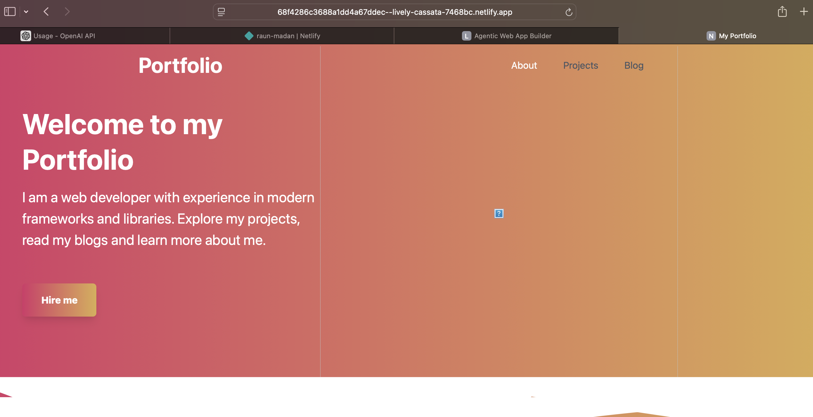
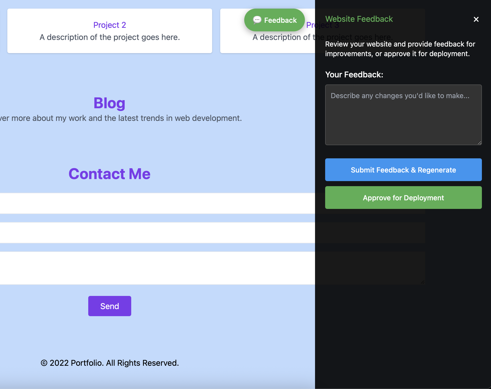

# Agentic Web App Builder

An intelligent multi-agent system that takes natural language input and autonomously builds, tests, deploys, and monitors web applications. You can check out a recently created portfolio site, [here](https://melodious-mousse-6807b2.netlify.app).

## Features

- 🤖 **Natural Language to Web App**: Describe your website in plain English
- 🧠 **Multi-Agent System**: Specialized agents for planning, development, testing, and monitoring
- 🚀 **Automated Deployment**: Deploy to Netlify or Vercel
- ✅ **Automated Testing**: Unit, integration, and UI testing
- 👤 **Human-in-the-Loop**: Approval workflows for critical decisions
- 📊 **Real-time Monitoring**: Track project progress and system health
- 🎨 **Modern Web UI**: Beautiful interface built with Tailwind CSS

## Quick Start

```bash
# 1. Install
python -m pip install -e .

# 2. Run
make dev
# or
uvicorn src.agentic_web_app_builder.api.main:app --reload

# 3. Open browser
# http://localhost:8000
```

**See [SETUP.md](SETUP.md) for detailed instructions.**

## Usage

1. Click **"Create Your Website"**
2. Describe your desired website
3. Review and approve the execution plan
4. Monitor progress as agents build your website
5. Preview and deploy

### Screenshots

**Fill in your website details:**


**Monitor project progress:**


**View your deployed site:**


**Preview feedback workflow - Original vs Fixed:**

_Original website with issues:_


_After applying preview feedback and fixes:_


## Architecture

Single API entry point (`api/main.py`) orchestrates specialized agents:

- **Planner Agent**: Analyzes requirements and creates execution plans
- **Developer Agent**: Generates code, manages Git, handles deployment
- **Tester Agent**: Runs automated tests
- **Monitor Agent**: Continuous monitoring and error detection

## Project Structure

```
src/agentic_web_app_builder/
├── api/main.py          # Single API entry point
├── agents/              # Specialized agents
├── core/                # Core system (config, database, interfaces, state)
├── models/              # Data models
├── tools/               # Tool integrations (LLM, Git, Deployment, Testing)
├── static/              # Web UI
└── utils/               # Utilities
```

## Documentation

- [SETUP.md](SETUP.md) - Setup and installation guide

## Development

```bash
# Install dev dependencies
python -m pip install -e ".[dev]"

# Run tests
make test

# Code formatting
make format

# Linting
make lint
```

## Troubleshooting

### Import Errors

```bash
python -m pip install -e .
```

### Port Already in Use

```bash
uvicorn src.agentic_web_app_builder.api.main:app --reload --port 8001
```

### LLM Not Working

Add `OPENAI_API_KEY` or `ANTHROPIC_API_KEY` to `.env` file.

See [SETUP.md](SETUP.md) for more troubleshooting tips.

## License

See LICENSE file for details.
