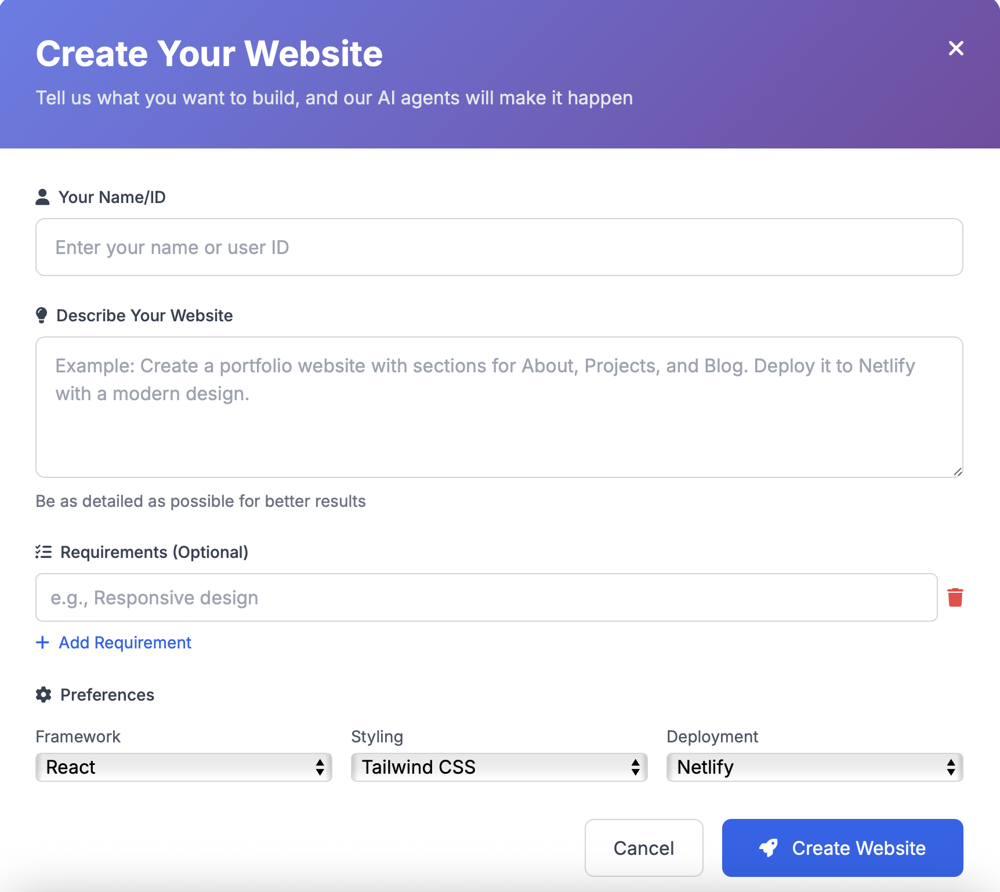
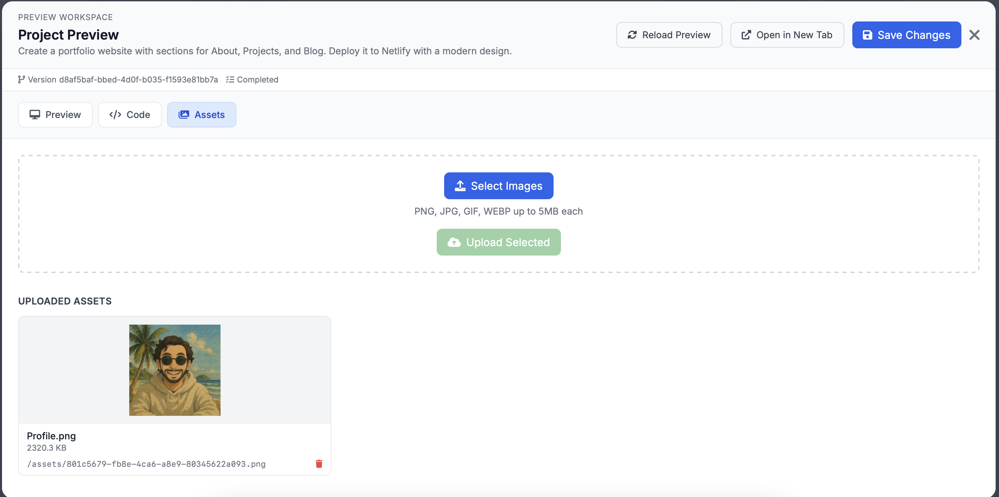
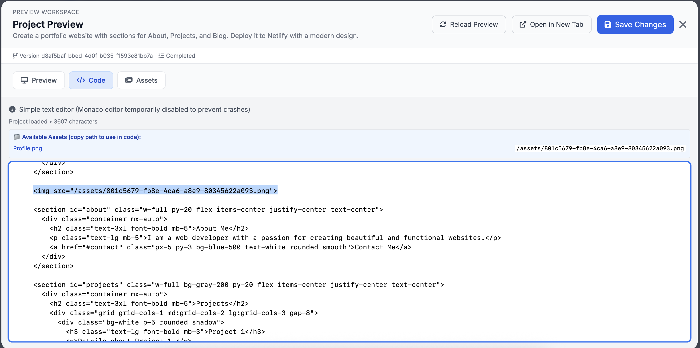
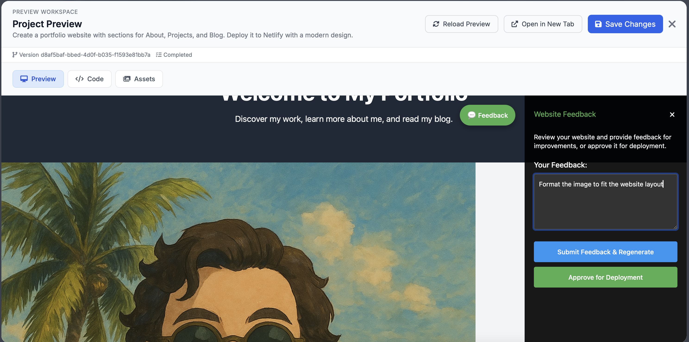
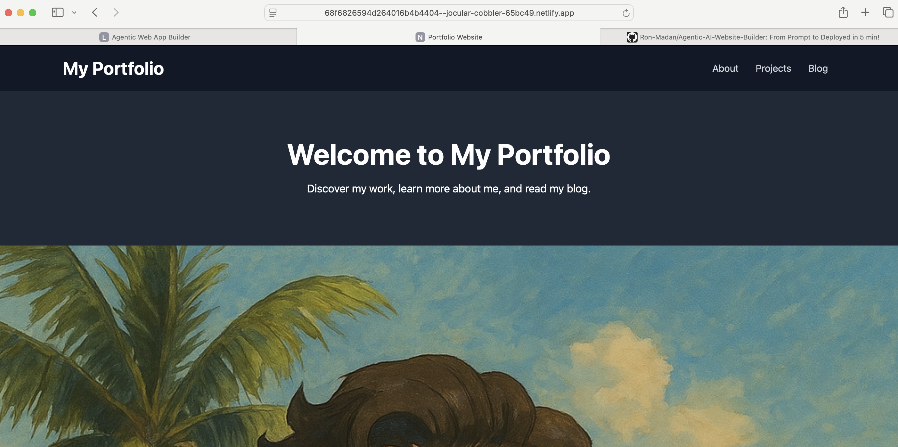

# Agentic Web App Builder

An intelligent multi-agent system that takes natural language input and autonomously builds, tests, deploys, and monitors web applications. You can check out a recently created portfolio site, [here]([https://68f6826594d264016b4b4404--jocular-cobbler-65bc49.netlify.app](https://frolicking-kulfi-040bca.netlify.app)).

## Features

- 🤖 **Natural Language to Web App**: Describe your website in plain English
- 🧠 **Multi-Agent System**: Specialized agents for planning, development, testing, and monitoring
- 🚀 **Automated Deployment**: Deploy to Netlify or Vercel
- ✅ **Automated Testing**: Unit, integration, and UI testing
- 👤 **Human-in-the-Loop**: Approval workflows for critical decisions
- 📊 **Real-time Monitoring**: Track project progress and system health
- 🎨 **Modern Web UI**: Beautiful interface built with Tailwind CSS

## Quick Start

```bash
# 1. Install
python -m pip install -e .

# 2. Run
make dev
# or
uvicorn src.agentic_web_app_builder.api.main:app --reload

# 3. Open browser
# http://localhost:8000
```

**See [SETUP.md](SETUP.md) for detailed instructions.**

## Usage

1. Click **"Create Your Website"**
2. Describe your desired website
3. Review and approve the execution plan
4. Monitor progress as agents build your website
5. Preview and deploy

### Screenshots

**Start with the initial prompt:**


**Manage assets (images, fonts, and media):**


**Edit code with live preview:**


**Review LLM feedback and apply fixes:**


**Deploy and view the live site:**


## Preview Workspace

A focused environment to iterate quickly:

- Initial Prompt: View and refine the prompt that generated the plan and scaffolding.
- Asset Manager: Upload/import logos, images, fonts, and documents; auto-optimize and organize by project.
- Code Editor: File tree, tabs, search, diffs, formatting, and tests with hot-reload preview.
- Live Preview: Instant updates, device presets, and viewport controls.
- Feedback Panel: Inline comments mapped to DOM/code, AI-suggested fixes with approve/apply.

## End-to-End Flow

1. Initial Prompt

   - Describe the site, goals, tech stack, and constraints.
   - Planner agent produces an execution plan; you can approve or refine.

2. Asset Manager

   - Add brand assets and content; the system links assets to components and pages.

3. Code Editor

   - Review generated code, make edits, run tests, and commit changes.

4. LLM Feedback

   - Leave comments in the preview; the LLM proposes changes.
   - Approve to apply; diffs are shown before merge.

5. Deployment
   - Choose Netlify or Vercel, set env vars, and run a preview build.
   - Promote to production and monitor deploy status and logs.

## Architecture

Single API entry point (`api/main.py`) orchestrates specialized agents:

- **Planner Agent**: Analyzes requirements and creates execution plans
- **Developer Agent**: Generates code, manages Git, handles deployment
- **Tester Agent**: Runs automated tests
- **Monitor Agent**: Continuous monitoring and error detection

## Project Structure

```
src/agentic_web_app_builder/
├── api/main.py          # Single API entry point
├── agents/              # Specialized agents
├── core/                # Core system (config, database, interfaces, state)
├── models/              # Data models
├── tools/               # Tool integrations (LLM, Git, Deployment, Testing)
├── static/              # Web UI
└── utils/               # Utilities
```

## Documentation

- [SETUP.md](SETUP.md) - Setup and installation guide

## Development

```bash
# Install dev dependencies
python -m pip install -e ".[dev]"

# Run tests
make test

# Code formatting
make format

# Linting
make lint
```

## Troubleshooting

### Import Errors

```bash
python -m pip install -e .
```

### Port Already in Use

```bash
uvicorn src.agentic_web_app_builder.api.main:app --reload --port 8001
```

### LLM Not Working

Add `OPENAI_API_KEY` or `ANTHROPIC_API_KEY` to `.env` file.

See [SETUP.md](SETUP.md) for more troubleshooting tips.

## License

See LICENSE file for details.
